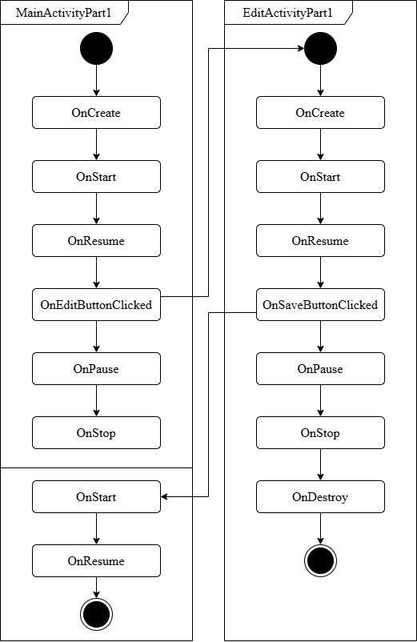
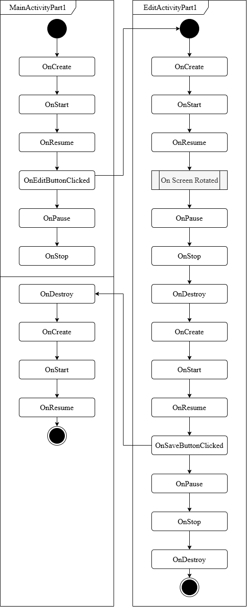

# LAB 1 DAA
## Auteurs
- Duruz Florian
- Ferreira Silva Sven
- Richard Aurélien

---
Groupe : DAA_B_12

Classe : DAA 2025-26

Date : 12/10/2025

## Partie 1

### Que se passe-t-il si l’utilisateur appuie sur « back » lorsqu’il se trouve sur la seconde Activité ?

L'activité EditActivityPart1 se ferme sans sauvegarder les modifications; le résultat retourné à MainActivityPart1 est RESULT_CANCELED (pas RESULT_OK) et donc le username devient null.
Pour y remédier on sauvegarde dans la classe le dernier username enregistré.

*L’utilisateur ouvre l’application, clique sur le bouton éditer, renseigne son prénom et sauve*

 

*L’utilisateur ouvre l’application en mode portrait, clique sur le bouton éditer, bascule en mode paysage, renseigne son prénom et sauve*

### Que faut-il mettre en place pour que vos Activités supportent la rotation de l’écran ? Est-ce nécessaire de le réaliser pour les deux Activités, quelle est la différence ?

Pour Sauvegarder l'état il faut implémenter : "onSaveInstanceState".
Pour La réstauration de l'état il faut implémenter : "onRestoreInstanceState".

Pour MainActivityPart1 - Nécessaire :
* La donnée username est stockée dans une variable membre
* Sans sauvegarde manuelle, la variable est réinitialisée à null après rotation
* Perte de données : le nom d'utilisateur disparaît

Pour EditActivityPart1 - Non Nécessaire :
* Le texte dans l'EditText est automatiquement sauvegardé par Android
* Les vues comme EditText implémentent leur propre onSaveInstanceState()

### BaseActivityPart1
Classe abstraite fournissant une base commune pour toutes les activités de la partie 1 implémentant les Log demandés.

### MainActivityPart1
Activité principale affichant le message de bienvenue et gérant l'édition du nom d'utilisateur.

Sauvegarde d'état manuelle pour la rotation:
* Justification : La donnée username est stockée dans une variable membre
* Nécessite onSaveInstanceState()/onRestoreInstanceState() pour survivre aux rotations
* Clé namespacée (@part1Welcome/username) pour éviter les conflits

Gestion des états null/vide :
* Justification : UX cohérente pour les cas nominaux et anonymes
* Affichage conditionnel selon la présence du nom d'utilisateur

### EditActivityPart1
Activité d'édition permettant la saisie et modification du nom d'utilisateur.

Pas de sauvegarde d'état manuelle :
* Justification : Les données sont stockées dans l'EditText qui gère automatiquement son état
* Android sauvegarde automatiquement le contenu des vues avec ID

Communication via Intent extras :
* Justification : Passage simple du nom existant à éditer
* Retour du résultat via setResult() avec Intent dédié
* Clé namespacée pour éviter les collisions

Nettoyage automatique des données :
* Justification : .trim() supprime les espaces superflus
* Évite les noms d'utilisateur avec espaces accidentels

### UsernameEditContract
Contrat définissant le format d'échange entre MainActivityPart1 et EditActivityPart1.

Types nullable (String?) :
* Justification : Support des cas nominaux (nom existant) et anonymes (null)
* Gestion propre des annulations (RESULT_CANCELED)

Encapsulation de la logique Intent :
* Justification : Centralise la création et l'analyse des Intent
* Les activités n'ont pas à connaître les clés et formats
* 
## Partie 2
### Les deux Fragments fournis implémentent la restauration de leur état. Si on enlève la sauvegarde de l’état sur le ColorFragment sa couleur sera tout de même restaurée, comment pouvons-nous expliquer cela ?
On peut l'expliquer car certes la couleur n'est plus sauvegardée mais les états (position) des seekbars le sont automatiquement. Donc quand la vue est recrée le progress des seekbars est restauré, ce qui va trigger le `OnSeekBarChangeListener` et donc changer la couleur à celle définie par les seekbars. Restaurant ainsi la couleur sans l'avoir sauvegardée.

### Si nous plaçons deux fois le CounterFragment dans l’Activité, nous aurons deux instances indépendantes de celui-ci. Comment est-ce que la restauration de l’état se passe en cas de rotation de l’écran ?
Comme pour un seul fragment. Ils sont certes de la même classe mais ces fragments sont bien 2 objets/entités distinctes. Le `FragmentManager` va sauvegarder et restaurer l'état de chacun de manière séparée.

## Partie 3

### A l’initialisation de l’Activité, comment peut-on faire en sorte que la première étape s’affiche automatiquement ?

Dans la méthode onCreate, on peut programmativement initialiser du code, dont la création du premier fragment.

### Comment pouvez-vous faire en sorte que votre implémentation supporte la rotation de l’écran ? Nous nous intéressons en particulier au maintien de l’état de la pile de Fragments et de l’étape en cours lors de la rotation.

Grâce aux méthodes onSaveInstanceState et onViewStateRestored, on peut restaurer l'état des fragments lors de la rotation de l'écran.
Cependant, à cause de l'ordonnancement d'exécution des différentes méthodes (onCreate, onStart, onRestoreInstanceState...), et à l'instanciation assez rapide du premier fragment (lors de onCreate), il a été nécessaire de récupérer dans le paramètre savedInstanceState de onCreate la valeur sauvegardée du stepper, ceci afin d'éviter d'avoir le tout premier fragment instancié sur rotation.

### Dans une transaction sur le Fragment, quelle est la différence entre les méthodes add et replace ?

Add va simplement instancier un nouveau fragment par-dessus (en partant du principe qu'on instancie dans la même view) celui déjà existant, ce qui doit nécessiter des travaux supplémentaires notamment en termes d'affichage.
Replace va supprimer le fragment courant et instancier le nouveau en lieu et place.